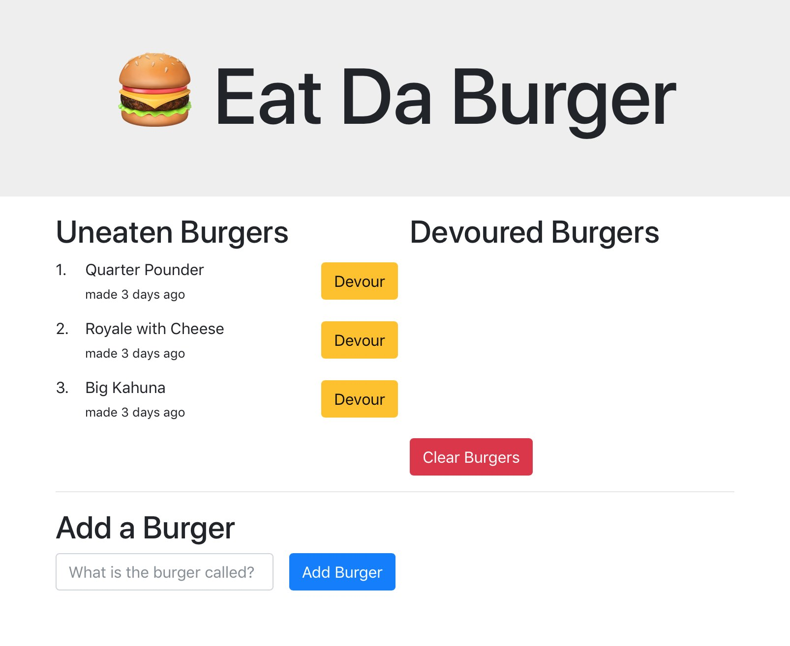

# ucsd0725-Burger

UCSD Coding Bootcamp HW Assignment 11

See the app running live [here](https://ucsd0725-eat-da-burger.herokuapp.com).

## Functionality

Users can submit new burger names, which are stored in a MySQL database.

Burgers are displayed in two lists filtered by whether they have been eaten yet.

Users can devour a burger and devoured burgers can be purged from the database.
